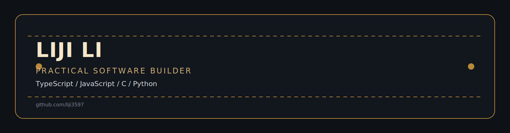

<div align="center">



<br/>

Liji Li · 李缉<br/>
Practical software builder.<br/>
更喜欢把东西做出来，也愿意把细节一点点打磨扎实。

<br/><br/>

I build practical software and developer-facing products across TypeScript, JavaScript, C, and Python.<br/>
我平时主要用 TypeScript、JavaScript、C 和 Python 做实用软件，也做一些面向开发者的产品。

<br/>

I focus on clear interfaces, reliable engineering foundations, and prototypes that can grow into real products.<br/>
我更在意界面是不是清楚、工程基础是不是稳，也希望原型不是一次性的 demo，而是真的能继续往下做。

<br/><br/>

[](https://github.com/liji3597)
[](https://twitter.com/liji_1357)
[](mailto:asd1020205749@foxmail.com)

</div>

<br/>


<br/>

## Quick Snapshot

```text
Focus .............. Practical product engineering, frontend systems, automation tools, and hands-on experimentation.
方向 .............. 我更关心能落地、能长期维护，也真的有人会去用的产品和工具。

Languages .......... TypeScript, JavaScript, C, and Python as my main working languages.
主要语言 .......... 平时最常用的是 TypeScript、JavaScript、C 和 Python。

Hackathons ......... SPARK AI Hackathon, USDC Agentic Hackathon, and First Spark Hackathon (4th place).
参赛经历 .......... 参加过 SPARK AI Hackathon、USDC Agentic Hackathon，也在 First Spark Hackathon 拿过第 4 名。

Work style ......... Learn fast, prototype quickly, and harden the parts that prove useful.
工作方式 .......... 先尽快把东西跑起来，再把真正值得继续做的部分一层层打磨扎实。
```

<br/>


<br/>

## Featured Projects

English first, Chinese right below each project card.<br/>
每个项目卡片都先写英文，再紧接中文说明。

### [`Bored Treasury Yield Club (BTYC)`](https://github.com/liji3597/LI.FI-hackaton-forntend)


Frontend prototype for a treasury yield workflow built during the LI.FI hackathon, with backend integration planned next.<br/>
这是我在 LI.FI 黑客松里做的国库收益流程前端原型，后面还会继续把后端接起来。

The execution concept follows Scheme A: proposal passes first, then a multisig manager reviews and triggers execution manually.<br/>
执行方案就按方案 A 走：提案先通过，再由多签管理员审核后手动执行。

<br/>

### [`Siliconflow-API-Management`](https://github.com/liji3597/Siliconflow-API-Management)


An API key management platform with load balancing, availability checks, sharing controls, and a visual admin layer.<br/>
这是一个做 API Key 管理的平台，包含负载均衡、可用性检测、共享权限和可视化管理。

It reflects my interest in practical tooling that solves operational problems with a clean product surface.<br/>
这个项目比较能代表我的偏好，就是把真实的运维问题做成顺手、好用的产品。

<br/>

### [`CACRS-on-STM32F4`](https://github.com/liji3597/CACRS-on-STM32F4)


An embedded project on STM32F4 covering signal collection, filtering, and downstream health-state analysis.<br/>
这是一个基于 STM32F4 的嵌入式项目，做了信号采集、滤波和后续健康状态分析。

It represents my low-level engineering side and my comfort working close to hardware constraints.<br/>
这个项目更偏底层，也说明我能接受贴着硬件约束去做工程开发。

<br/>

### [`Forwarding-TG-bot`](https://github.com/liji3597/Forwarding-TG-bot)


A Telegram automation tool for forwarding, filtering, regex replacement, and protected-content extraction.<br/>
这是一个 Telegram 自动化工具，支持消息转发、关键词过滤、正则替换和受保护内容提取。

It shows my preference for small, sharp utilities that are useful immediately in real workflows.<br/>
这类项目我一直挺喜欢，体量不一定大，但上手就能解决具体问题。

<br/>


<br/>

## Core Stack

Primary tools and languages.<br/>
核心语言与常用技术栈。

<p align="left">
  
  
  
  
</p>

<p align="left">
  
  
  
  
  
</p>

<br/>


<br/>

## GitHub Stats

One compact row for activity and language distribution.<br/>
用一行简洁展示活跃度和语言分布。

<div align="center">
  <a href="https://github.com/liji3597">
    
  </a>
  <a href="https://github.com/liji3597">
    
  </a>
</div>

<br/>


<br/>

## Contact

Available for collaboration on practical products, developer tools, and frontend-heavy prototypes.<br/>
如果你也在做实用型产品、开发者工具，或者偏前端的原型项目，欢迎直接来聊。

<p align="center">
  <a href="https://github.com/liji3597">
    
  </a>
  <a href="https://twitter.com/liji_1357">
    
  </a>
  <a href="mailto:asd1020205749@foxmail.com">
    
  </a>
</p>
